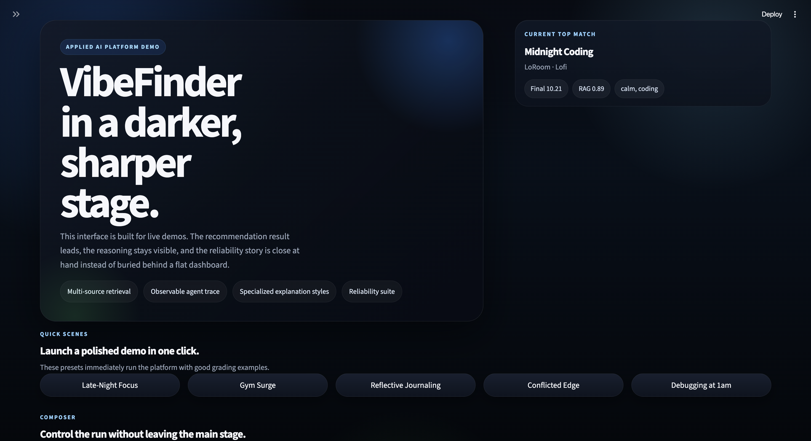
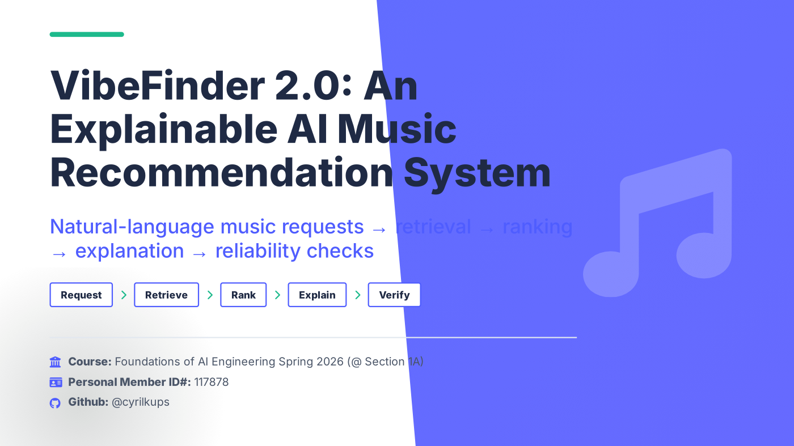
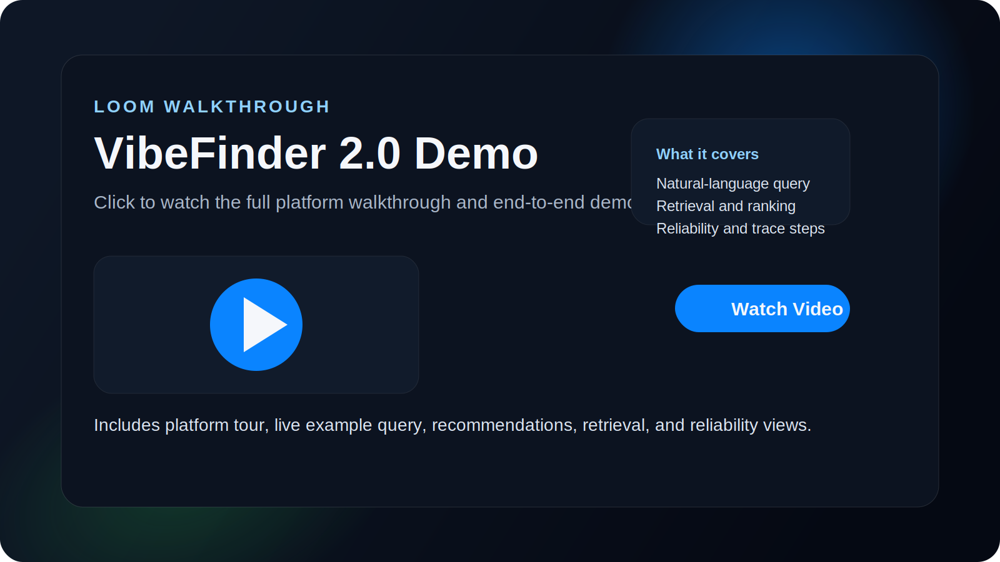
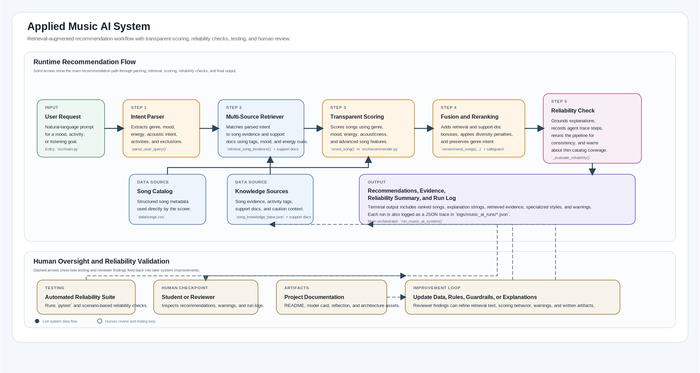

# VibeFinder 2.0: Retrieval-Augmented Music Recommendation System

## Original Project: Transparent Music Recommender (Modules 1-3)

**VibeFinder** began as a content-based music recommendation engine that scored songs using explicit, interpretable rules. It accepted a user's structured preferences (favorite genre, mood, energy level) and returned ranked songs with mathematical reasoning visible at every step. The original system prioritized transparency over personalization—every score decision could be traced to a documented rule.

---

## Platform Banner



## Presentation Slides

[](assets/slides/codepath-course-project-slides.pdf)

**Click the slide preview to open the full presentation PDF.**

## Loom Walkthrough Video

[](https://www.loom.com/share/3806cfedff7f41dd978931972a3f70ff)

**Click the video preview to watch the Loom walkthrough.**


## What This Project Does and Why It Matters

**VibeFinder 2.0** transforms the earlier recommender into a **real-world applied AI system** by adding natural-language understanding, retrieval-augmented reasoning, and built-in reliability checks. Instead of requiring users to fill out structured forms, the system now accepts conversational requests like:

- `"Need calm music for late-night coding"`
- `"Need classical music for an intense workout"`
- `"Play nostalgic acoustic music for journaling"`

It parses these requests, retrieves supporting evidence from a knowledge base, ranks songs with explainable rules, and explains _why_ each recommendation matches the intent. The system also **checks its own consistency** and warns when the catalog is too limited to reliably answer a query.

**Why this matters for employers:** This project demonstrates how to build AI systems that are not just intelligent, but _trustworthy_—combining NLP, retrieval, ranking, and reliability checks in a cohesive pipeline that leaves an audit trail for human review.

---

## Architecture Overview

```
┌─────────────────────────────────────────────────────────────────┐
│                    User Request (Natural Language)               │
│                  "Need calm music for late-night coding"         │
└────────────────────────────┬────────────────────────────────────┘
                             │
                             ▼
┌─────────────────────────────────────────────────────────────────┐
│                    Intent Parser (NLP)                           │
│  Extracts: genre, mood, energy, activity_tags, preferences      │
│  Selects: scoring mode (mood_first, energy_focused, etc.)       │
└────────────────────────────┬────────────────────────────────────┘
                             │
                             ▼
┌─────────────────────────────────────────────────────────────────┐
│        Multi-Source Retrieval Layer                              │
│  Matches intent against song_knowledge_base.json +               │
│  query_support_documents.json for synonym-heavy prompts          │
│  Returns: retrieval_score, matched_evidence, support-doc hints   │
└────────────────────────────┬────────────────────────────────────┘
                             │
                             ▼
┌─────────────────────────────────────────────────────────────────┐
│         Transparent Recommender (Explicit Scoring)               │
│  Combines: metadata scoring + retrieval bonuses                  │
│  Applies: support-doc bonuses, genre safeguards, diversity       │
│  Returns: ranked recommendations with explanation strings        │
└────────────────────────────┬────────────────────────────────────┘
                             │
                             ▼
┌─────────────────────────────────────────────────────────────────┐
│     Agent Trace + Reliability Layer (Self-Checking)              │
│  Saves observable planning / retrieval / ranking steps           │
│  Reruns the pipeline once to compare consistency                 │
│  Emits: warnings (thin catalog, conflicting intent)              │
│  Flags: grounded status, consistency_ok                          │
└────────────────────────────┬────────────────────────────────────┘
                             │
                             ▼
┌─────────────────────────────────────────────────────────────────┐
│            Output: Explained Recommendations                     │
│  - Top 3-5 songs with title, artist, score breakdown            │
│  - Retrieved evidence snippets and support-doc matches           │
│  - Optional specialized explanation styles                       │
│  - Reliability warnings and confidence indicators                │
│  - Full trace log saved to JSON for audit                        │
└─────────────────────────────────────────────────────────────────┘
```

**Key insight:** Retrieval scores _directly change the final ranking_, not just displayed alongside it. In the enhanced version, both song evidence and query-support documents can change the final order, making the system context-aware rather than purely statistical.

---

## Optional Bonus Features Implemented

This version now includes all four optional stretch features from the rubric:

- **RAG enhancement (+2):** the retriever now uses a second document source, `data/query_support_documents.json`, to map synonym-heavy prompts like `"spin class intervals"` or `"decompress after work"` onto stronger activity tags before ranking.
- **Agentic workflow enhancement (+2):** every query produces an observable intermediate trace with steps like `parse_query`, `retrieve_support_docs`, `plan_with_support_docs`, `retrieve_song_evidence`, `rank_recommendations`, and `self_check`.
- **Fine-tuning / specialization (+2):** the system can generate constrained listener-facing explanations using style cards in `data/style_cards.json` such as `focus_coach`, `hype_trainer`, and `reflective_curator`.
- **Test harness / evaluation script (+2):** `python -m src.main evaluate` compares baseline single-source retrieval against the enhanced system and prints pass/fail style summaries.

**Measured result from the local evaluation harness:** multi-source retrieval improved `hit@3` from `5/7` to `7/7`, with `0.95` average confidence, `7.00` observable trace steps per run, and `100%` specialization compliance.

---

## Setup Instructions

### Prerequisites

- Python 3.8 or later
- pip (Python package manager)

### 1. Clone or Download the Repository

```bash
cd /path/to/applied-ai-system-project
```

### 2. Install Dependencies

```bash
pip install -r requirements.txt
```

Required packages:

- `pandas` – data manipulation and song catalog loading
- `pytest` – unit test execution
- `streamlit` – (optional) for interactive demos

### 3. Verify the Data Files Exist

Check that these files are present:

```bash
data/songs.csv                    # 18 songs with structured metadata
data/song_knowledge_base.json     # Retrieval evidence for each song
data/query_support_documents.json # Second retrieval source for synonym-heavy prompts
data/style_cards.json             # Constrained explanation styles
data/evaluation_queries.json      # Inputs used by the evaluation harness
```

### 4. Run the System (Command-Line)

```bash
python -m src.main
```

This prints:

- Available evaluation profiles
- System recommendations for each profile
- Benchmark results
- Reliability checks and warnings

### 5. Run Unit Tests

```bash
pytest tests/ -v
```

Expected output: All tests pass, confirming that the system behaves as documented.

---

## Sample Interactions

### Example 1: Focus-First Late-Night Coding Session

**Input:**

```
"Need calm music for late-night coding"
```

**Current System Parsing:**

- Detected mood: `calm`
- Target energy: about `0.32`
- Activity tags: `coding`, `focus`, `late-night`, plus support-doc additions like `reflection` and `unwind`
- Scoring mode: `mood_first`

**Current Top Recommendations:**
| Rank | Song | Artist | Why It Ranks |
|------|------|--------|--------------|
| 1 | Midnight Coding | LoRoom | Strong focus evidence, low-distraction energy, and support-doc bonuses for late-night work. |
| 2 | Focus Flow | LoRoom | Focus-heavy retrieval match with steady energy and strong grounding for heads-down work. |
| 3 | Library Rain | Paper Lanterns | Quiet acoustic background option with strong calm/focus evidence. |

**Reliability Status:**

- ✅ Grounded: Yes (catalog has strong focus/coding coverage)
- ✅ Consistent: Yes (comparison rerun returned the same top results)
- ⚠️ Warnings: None

**What this shows:** the enhanced system is not only matching direct song evidence, but also using support documents to strengthen the late-night focus interpretation.

---

### Example 2: High-Energy Gym Workout

**Input:**

```
"Need high-energy music for the gym"
```

**Current System Parsing:**

- Detected mood: `intense`
- Target energy: about `0.93`
- Activity tags: `workout`, `gym`, `push`, `drive`
- Scoring mode: `energy_focused`

**Current Top Recommendations:**
| Rank | Song | Artist | Why It Ranks |
|------|------|--------|--------------|
| 1 | Gym Hero | Max Pulse | Strongest direct gym match with very high energy and support-doc bonuses. |
| 2 | Storm Runner | Voltline | Excellent high-adrenaline fit with intense mood and driving energy. |
| 3 | Neon Pulse Circuit | Static Bloom | Strong cardio / dance intensity with high live-energy evidence. |

**What this shows:** the `spin class cardio guide` support document improves retrieval for workout-like phrasing and helps the system generalize beyond the exact word `gym`.

---

### Example 3: Edge Case—Classical Music for Intense Workout (Conflicting Requests)

**Input:**

```
"Need classical music for an intense workout"
```

**Current System Parsing:**

- Detected genre: `classical`
- Detected mood: `intense`
- Target energy: about `0.93`
- Conflict remains: the catalog has very thin coverage for `classical + intense workout`

**Current Top Recommendations (with Genre Safeguard Applied):**
| Rank | Song | Artist | Why It Ranks |
|------|------|--------|--------------|
| 1 | Storm Runner | Voltline | Best raw workout/intensity fit in the catalog. |
| 2 | Gym Hero | Max Pulse | Strong gym match with very high energy. |
| 3 | Neon Pulse Circuit | Static Bloom | Strong cardio intensity fit. |
| 5 | Glass Morning | Aurora Vale | Reinserted by the genre-coverage safeguard so the explicit classical request is not silently dropped. |

**Reliability Status:**

- ✅ Grounded: Yes
- ✅ Consistent: Yes
- 🚨 **Warning:** `"the requested genre and energy combination has very thin catalog support"`

**Key insight:** Instead of silently ignoring the genre request, the system exposes the tradeoff and keeps a classical item in the list through the safeguard. This is a hallmark of responsible AI design.

---

## Design Decisions

### 1. **Retrieval-Augmented Ranking (vs. Metadata-Only)**

**Decision:** Retrieval scores are fused directly into final rankings, not shown as auxiliary information.

**Why:** A pure metadata recommender can't understand context like "late-night coding" or "journaling." By maintaining a hand-curated knowledge base with scene descriptions and activity tags, the system becomes context-aware. Retrieval bonuses actually _change_ which songs rank highest.

**Trade-off:** The knowledge base is small and hand-authored, so retrieval is lexical (keyword-based), not semantic (embedding-based). This limits scalability but ensures full transparency and controllability.

---

### 2. **Explicit Parser for Intent (vs. End-to-End Neural Model)**

**Decision:** User queries are parsed into a structured dataclass using rule-based NLP (keyword matching, stopword removal).

**Why:**

- Fully interpretable: every parse decision is traceable and reviewable.
- Testable: behavior is deterministic and unit-testable.
- Aligned with transparency requirement: no black-box embeddings.

**Trade-off:** Parsing is brittle with edge cases and creative phrasing. A neural model would be more robust but less explainable. For this project, explainability wins.

---

### 3. **Genre Safeguard (vs. Optimal Ranking Alone)**

**Decision:** When a user explicitly names a genre, at least one song from that genre appears in the top-5, even if lower-scoring items must be promoted.

**Why:** Users sometimes have strong genre preferences that shouldn't be silently ignored. The safeguard honors intent and prevents the "recommendation surprise" where a user gets playlists they didn't ask for.

**Trade-off:** Top recommendations might have slightly lower scores. But honesty about this tradeoff (through warning flags) is better than silently violating intent.

---

### 4. **Self-Checking Reliability Layer (vs. Single-Pass Inference)**

**Decision:** Every query triggers a comparison rerun of the full pipeline to check consistency.

**Why:**

- Detects regressions or unexpected ranking changes between identical runs.
- Flags when small catalog changes affect rankings significantly.
- Provides a confidence score: "how stable is this recommendation?"

**Trade-off:** Roughly 2x computational cost because each query is evaluated twice. Acceptable for a demonstration system; would need optimization for production.

---

### 5. **JSON Logging Every Run**

**Decision:** Each recommendation triggers a detailed JSON trace log saved to `logs/music_ai_runs/`.

**Why:** Enables post-hoc review and debugging. Future work can analyze patterns across runs (e.g., "which queries cause warnings?").

**Trade-off:** Disk space and I/O overhead. Mitigation: logs are only created during evaluation; users can disable logging.

---

## Reliability and Evaluation

**Short summary:** `14/14` automated tests passed with `pytest tests/ -v`, the `4/4` benchmark prompts in `python -m src.main reliability` produced the expected hits, warning behavior, grounding, and consistency results, and the optional feature harness in `python -m src.main evaluate` improved multi-source `hit@3` from `5/7` to `7/7`. The system is strongest when the request overlaps with known catalog tags like `coding`, `gym`, or `journaling`, and the added support documents now help on synonym-heavy prompts that used to fall back to generic happy-pop recommendations.

### How I Tested It

- **Automated tests:** `tests/test_recommender.py`, `tests/test_music_ai_system.py`, and `tests/test_optional_features.py` verify parsing, ranking, genre safeguards, support-document retrieval, trace generation, specialization output, benchmark behavior, and JSON log writing.
- **Consistency check:** `run_music_ai_system()` reruns the same query once and compares the recommendation IDs to confirm stable output for the deterministic pipeline.
- **Logging:** each run can write a JSON trace to `logs/music_ai_runs/` with the parsed intent, retrieved evidence, final recommendations, and reliability warnings.
- **Feature harness:** `python -m src.main evaluate` compares single-source retrieval against the enhanced multi-source version on a fixed set of prompts and prints summary metrics.
- **Human evaluation:** I manually reviewed the coding, workout, journaling, and conflicting-genre outputs to check that the explanations matched the returned songs.

### What Worked

- Intent parsing correctly maps clear prompts like `"Need calm music for late-night coding"` and `"Need high-energy music for the gym"` into sensible moods, energy targets, and activity tags.
- Retrieval bonuses meaningfully affect ranking order instead of sitting beside the results unused.
- The genre safeguard keeps an explicitly requested genre in the top results for contradictory prompts such as classical plus intense workout.
- The reliability suite correctly emits a warning for the conflicting classical-workout scenario while keeping the benchmark results consistent.

### What Didn't Work Yet

- Lexical retrieval misses some semantically similar phrasing, so prompts like `"music for unwinding"` are weaker than keyword-heavy prompts such as `"calm"` or `"relaxed"`.
- The catalog has only `18` songs, which makes some genre plus mood combinations thin and increases the need for warnings or fallback behavior.
- The system does not learn from user feedback or listening history yet, so every query is answered fresh with the same rules.
- The current consistency check is useful for catching regressions, but it is not a probability-based confidence score or a full robustness test under noisy inputs.

### Concrete Results

- `14/14` tests passed locally.
- `4/4` benchmark scenarios passed locally.
- The optional evaluation harness improved multi-source `hit@3` from `5/7` to `7/7`.
- Specialized explanation compliance was `100%` across the evaluation set.
- JSON logging worked for both test runs and CLI runs.
- The main failure mode is missing or weak lexical context, not code crashes.

---

## Reflection and Ethics

This project pushed me to think about AI as a system that should be honest about its limits, not just good at producing plausible outputs. The final version is better than the earlier prototype because it does more than rank songs: it parses a natural-language request, retrieves supporting evidence, explains its choices, and warns when the catalog is weak.

### Limitations and Biases

- The catalog is small and hand-curated, so the system reflects my own tagging choices and genre coverage gaps.
- Retrieval is lexical rather than semantic, which means phrasing matters a lot. A request using unfamiliar wording may perform worse even if the intent is reasonable.
- The recommender is not personalized. It does not learn from user history, which keeps it simpler and more transparent, but also less adaptive.

### Misuse and Prevention

This system could be misused if someone treated it like an authority on a user's mood, identity, or mental state. It should only be used as a transparent music recommendation helper, not as a tool for psychological inference or manipulation. To reduce misuse, I kept the scope narrow, surfaced warnings for weak matches, included evidence in the explanations, and saved logs so a human can review how the result was produced.

### What Surprised Me During Reliability Testing

The most surprising result was how stable the system was on well-covered requests like coding or gym prompts, and how quickly its weaknesses showed up on thin or contradictory requests. I expected the scoring formula to be the hardest part, but the bigger issue was data coverage and vocabulary mismatch. Testing made it clear that reliability depends as much on the dataset and retrieval rules as on the ranking logic.

### Collaboration With AI

I used AI as a pair-programming and writing assistant throughout the project. One helpful suggestion was to treat the system as a pipeline with separate parsing, retrieval, ranking, and reliability steps, which made the code easier to test and the behavior easier to explain. One flawed suggestion was an earlier AI-generated draft that described sample outputs and a stronger reliability process than the code actually produced; that mistake reminded me to verify AI suggestions against real runs, tests, and logs before trusting them.

### Key Takeaway

The biggest lesson from this project is that responsible AI is not just about making a system look smart. It is about making its behavior inspectable, testable, and appropriately limited. In practice, that meant building warnings, logs, and verification into the project instead of hiding uncertainty behind polished recommendations.

### What This Says About Me as an AI Engineer

This project shows that I approach AI engineering as systems work, not just model output work. I care about building tools that are explainable, testable, and honest about their limits. Instead of stopping at "it gives a reasonable answer," I focused on retrieval quality, observable reasoning steps, reliability checks, and clear documentation so another person can inspect, trust, and improve the system. That reflects the kind of AI engineer I want to be: practical, transparent, and responsible about how intelligent behavior is designed and evaluated.

---

## File Structure

```
applied-ai-system-project/
├── README.md                          # This file
├── model_card.md                      # Formal model documentation
├── reflection.md                      # Developer reflection on lessons learned
├── Slide.md                           # Slide content and speaking notes
├── Recording.md                       # Loom walkthrough speaking guide
├── requirements.txt                   # Python dependencies
├── streamlit_app.py                   # Streamlit frontend demo
│
├── src/
│   ├── __init__.py
│   ├── main.py                        # CLI entry point; runs demo profiles and benchmarks
│   ├── evaluation.py                  # Optional-feature evaluation harness and summary metrics
│   ├── music_ai_system.py             # Core pipeline: parser → retrieval → ranking → reliability
│   └── recommender.py                 # Transparent scoring rules and metadata engine
│
├── scripts/
│   └── run_feature_evaluation.py      # Standalone wrapper for the evaluation harness
│
├── tests/
│   ├── conftest.py                    # Pytest fixtures
│   ├── test_music_ai_system.py        # Integration tests for full pipeline
│   ├── test_optional_features.py      # Tests for support docs, trace steps, and specialization
│   └── test_recommender.py            # Unit tests for ranking and scoring
│
├── data/
│   ├── songs.csv                      # Catalog metadata (18 songs)
│   ├── song_knowledge_base.json       # Retrieval evidence and scene descriptions
│   ├── query_support_documents.json   # Query-level support docs for the enhanced retriever
│   ├── style_cards.json               # Constrained explanation styles
│   └── evaluation_queries.json        # Fixed evaluation prompts for the harness
│
├── logs/
│   └── music_ai_runs/                 # JSON trace logs from each run
│
└── assets/
    ├── architecture/                  # System diagram (PNG and SVG)
    ├── demos/                         # Demo screenshots / CLI output SVGs
    ├── screenshots/                   # Platform banner and README visuals
    └── slides/                        # Presentation PDF and preview image
```

---

## Running the System

### Quick Start

```bash
python -m src.main
```

This prints the full demo: 4 evaluation profiles with recommendations, retrieval details, benchmark results, and reliability checks.

### Apple-Style Demo UI

```bash
streamlit run streamlit_app.py
```

This launches a polished frontend for live demos of:

- natural-language querying
- multi-source retrieval
- specialized explanation styles
- observable agent traces
- reliability and evaluation views

### Query With Observable Trace

```bash
python -m src.main query "Need something for debugging at 1am" --show-trace
```

This prints the intermediate agent-style steps, the matched support documents, and the final recommendations.

### Query With Specialized Explanations

```bash
python -m src.main query "Need something for debugging at 1am" --specialization auto
```

This adds constrained listener-facing explanations such as `Focus Coach`, `Hype Trainer`, or `Reflective Curator`.

### With Logging

```bash
python -c "from src.music_ai_system import run_music_ai_system; \
run_music_ai_system('Need calm music for late-night coding', enable_logging=True)"
```

A JSON log is saved to `logs/music_ai_runs/` with timestamp and query hash.

### Run Tests

```bash
pytest tests/ -v
```

### Benchmark Reliability

```bash
python -c "from src.music_ai_system import run_reliability_suite; \
run_reliability_suite()"
```

### Evaluate Optional Features

```bash
python -m src.main evaluate
```

or

```bash
python scripts/run_feature_evaluation.py
```

This compares:

- baseline single-source retrieval
- enhanced multi-source retrieval
- average confidence
- trace-step visibility
- specialization compliance

---

## Model Card and Documentation

See [model_card.md](model_card.md) for formal documentation of:

- Model name and intended use
- Strengths and limitations
- Dataset description
- Bias and fairness considerations

See [reflection.md](reflection.md) for the developer's reflective essay on lessons learned.

---

## Key Technologies

- **Python 3.8+** – Core language
- **Pandas** – Data loading and manipulation
- **Pytest** – Unit and integration testing
- **JSON** – Trace logging and structured data

---

## License

This project is provided as-is for educational and portfolio purposes. Modify and distribute freely with attribution.

---

## Contact & Questions

For questions about the architecture, design decisions, or how specific components work, refer to:

- `src/music_ai_system.py` (well-commented pipeline)
- `model_card.md` (formal technical documentation)
- `reflection.md` (design thinking and lessons learned)

## System Architecture



The runtime architecture is:

- `src/main.py`
  CLI entry point for baseline profiles, natural-language queries, and reliability runs

- `src/music_ai_system.py`
  Orchestrates parsing, retrieval, score fusion, explanation generation, consistency checking, and JSON logging

- `src/recommender.py`
  Transparent scoring engine with multiple modes and diversity-aware reranking

- `data/songs.csv`
  Structured catalog used by the recommender

- `data/song_knowledge_base.json`
  Retrieval corpus with activity tags, scene descriptions, evidence snippets, and caution context

- `tests/test_music_ai_system.py`
  Reliability-focused tests for parsing, retrieval behavior, genre safeguards, and logging

---

## How Data Flows Through the System

1. A user enters a natural-language request in the CLI.
2. The parser extracts genre, mood, energy, acoustic preference, activities, and exclusions.
3. The retriever scores song evidence documents against that parsed intent.
4. The recommender computes transparent content-based scores for every song.
5. Retrieval bonuses are added to those scores, then diversity reranking is applied.
6. If an explicit genre request disappears from the top list, a genre-coverage safeguard reintroduces the best matching genre item.
7. The system produces:
   - retrieved evidence
   - ranked recommendations
   - explanation strings
   - reliability warnings
   - a JSON run log
8. A reliability check reruns the pipeline and compares results for consistency.

---

## Trust, Guardrails, and Reliability

The system is designed to be inspectable and cautious:

- `Grounded explanations`
  Recommendations include retrieved evidence text in the explanation string.

- `Consistency check`
  The pipeline reruns the same query and verifies that the top recommendations stay stable.

- `Catalog-gap warnings`
  If the catalog poorly supports a request, the system says so instead of pretending it has strong coverage.

- `Genre-coverage safeguard`
  If a user explicitly asks for a genre and the top list loses it, the system inserts the strongest genre-matching candidate and labels that decision.

- `JSON logging`
  Every query run can be saved to `logs/music_ai_runs/` so a reviewer can inspect the parsed intent, retrieved evidence, final recommendations, and reliability output.

- `Benchmark suite`
  `python -m src.main reliability` runs a small evaluation set that checks expected hits, warning behavior, grounding, and consistency.

---

## Project Structure

```text
assets/
  architecture/
    music-ai-system-architecture.svg
  demos/
    chill-lofi.svg
    cli-output.svg
  screenshots/
    platform-banner.png
    loom-walkthrough-thumbnail.svg
  slides/
    codepath-course-project-slides.pdf
    codepath-course-project-slides-preview.png
data/
  songs.csv
  song_knowledge_base.json
logs/
  music_ai_runs/
src/
  main.py
  music_ai_system.py
  recommender.py
tests/
  test_music_ai_system.py
  test_recommender.py
README.md
Recording.md
Slide.md
model_card.md
reflection.md
requirements.txt
streamlit_app.py
```

---

## Setup

1. Create and activate a virtual environment if you want an isolated environment:

```bash
python -m venv .venv
source .venv/bin/activate
```

2. Install dependencies:

```bash
pip install -r requirements.txt
```

3. Run the baseline recommender profile suite:

```bash
python -m src.main
```

4. Run the applied AI system with a natural-language request:

```bash
python -m src.main query "Need calm music for late-night coding"
```

5. Run the reliability benchmark suite:

```bash
python -m src.main reliability
```

6. Run unit tests:

```bash
pytest
```

---

## Useful Commands

Baseline scoring modes:

```bash
python -m src.main balanced
python -m src.main genre_first
python -m src.main mood_first
python -m src.main energy_focused
python -m src.main all
python -m src.main balanced --no-diversity
```

Natural-language recommendation queries:

```bash
python -m src.main query "Need high-energy music for the gym"
python -m src.main query "Play nostalgic acoustic music for journaling"
python -m src.main query "Need classical music for an intense workout"
python -m src.main "Need focused music for writing"
```

Optional query controls:

```bash
python -m src.main query "Need upbeat music for a run" --top-k 3
python -m src.main query "Need moody night-drive music" --mode mood_first
python -m src.main query "Need soft acoustic music" --no-diversity
```

---

## Example Reliability Scenarios

The built-in benchmark suite currently checks:

- `Focus Coding`
  expects focus-friendly tracks such as `Midnight Coding` or `Focus Flow`

- `Workout Boost`
  expects high-energy workout tracks such as `Gym Hero` or `Storm Runner`

- `Nostalgic Journaling`
  expects reflective acoustic results such as `Fireside Letters`

- `Conflicted Classical Workout`
  expects a warning and still preserves a classical recommendation through the genre safeguard

---

## Why This Counts as an Applied AI System

This repo now goes beyond a small recommendation script because the AI behavior depends on a multi-step pipeline:

- parse
- retrieve
- rank
- explain
- self-check
- log

That makes it a better example of a professional applied AI artifact: it is reproducible, inspectable, and explicit about what it knows and where it is weak.

---

## Limitations

- The catalog is still tiny and hand-authored.
- Retrieval is lexical and rule-based, not embedding-based.
- The system does not use real streaming behavior or collaborative filtering.
- Some contradictory requests still produce imperfect tradeoffs because the catalog itself is limited.

Those limitations are surfaced in warnings and in the model card rather than hidden.
